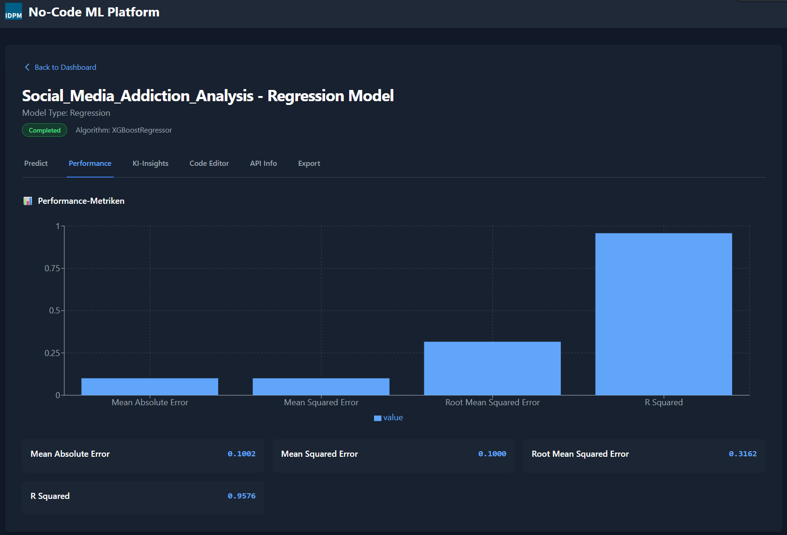

# 🤖 No-Code ML Platform

Eine vollständige Machine Learning Platform, die es ermöglicht ohne Programmierkenntnisse ML-Modelle zu trainieren und bereitzustellen.

## ✨ Features

### 🔧 **Flexible Algorithmus-Auswahl**
- **Klassifikation**: Random Forest, Logistic Regression, SVM, XGBoost
- **Regression**: Random Forest, Linear Regression, SVR, XGBoost
- Automatische Algorithmus-Empfehlungen basierend auf Datentypen
- Komplexitäts-Bewertung für jeden Algorithmus

### 📊 **Intelligente Datenverarbeitung**
- **CSV-Upload & Analyse**: Automatische Datentyp-Erkennung
- **Erweiterte Preprocessing-Pipeline**: Skalierung, One-Hot-Encoding, Label-Encoding
- **Smart Data Cleaning**: Behandlung fehlender Werte
- **Feature-Engineering**: Automatische Preprocessing je nach Datentyp

### 🎯 **Erweiterte Metriken**
- **Klassifikation**: Accuracy, Precision, Recall, F1-Score, AUC-ROC, Classification Report
- **Regression**: MAE, MSE, RMSE, R², MAPE
- **Feature Importance**: Visualisierung der wichtigsten Features

### 🧠 **LLM-basierte Script-Generierung**
- **Intelligente Python-Scripts**: Maßgeschneidert für jedes Projekt
- **Adaptive Preprocessing**: Automatisch angepasst an Datentypen
- **Optimierte Algorithmen**: LLM wählt beste Parameter
- **Zero-Template-Ansatz**: Vollständig generierte Scripts statt starrer Templates

### 🚀 **Echte REST-API**
- **Training-API**: Automatisches Model-Training mit echten Python-Scripts
- **Prediction-API**: Echte Vorhersagen mit trainierten Modellen
- **Model-Export**: Download der trainierten .pkl-Modelle
- **Persistente Speicherung**: SQLite-Datenbank für alle Projekte

### 🎨 **Moderne Benutzeroberfläche**
- Intuitive 3-Schritte Wizard für Projekt-Erstellung
- Echzeit-Datei-Analyse mit Spalten- und Zeilenzahl
- Live-Training-Status mit Polling
- Performance-Visualisierung mit Charts
- Responsive Design

## 🏗️ Architektur

```
ML-Platform/
├── backend/          # Node.js + Express + SQLite
│   ├── server.js     # Haupt-Server mit REST-API
│   ├── models/       # Gespeicherte .pkl-Modelle
│   ├── scripts/      # Generierte Python-Scripts
│   └── uploads/      # Hochgeladene CSV-Dateien
├── frontend/         # React + TypeScript
│   ├── components/   # UI-Komponenten
│   ├── services/     # API-Services
│   └── types.ts      # TypeScript-Definitionen
└── README.md
```

## 🚀 Installation & Start

### Voraussetzungen
- Node.js (Version 16+)
- Python 3.x mit ML-Paketen:
  ```bash
  pip install pandas scikit-learn joblib numpy xgboost
  ```

### Backend starten
```bash
cd backend
npm install
npm run dev          # Entwicklungsserver auf Port 3001
```

### Frontend starten  
```bash
cd frontend
npm install
npm run dev          # Entwicklungsserver auf Port 5173
```

## 📡 API Endpoints

### 🔄 **Projekt-Management**
```http
GET    /api/projects              # Alle Projekte abrufen
POST   /api/projects              # Neues Projekt erstellen  
GET    /api/projects/:id          # Einzelnes Projekt abrufen
DELETE /api/projects/:id          # Projekt löschen
```

### 📤 **Datei-Upload**
```http
POST   /api/upload           # CSV-Datei hochladen & analysieren
```

### 🎯 **Model-Operationen**
```http
POST   /api/projects/:id/predict  # Vorhersage mit trainiertem Modell
GET    /api/projects/:id/download # Trainiertes Modell herunterladen
```

## 🔬 Verwendung

### 1️⃣ **Projekt erstellen**
- CSV-Datei hochladen
- Automatische Datenanalyse 
- Algorithmus auswählen
- Zielvarible und Features festlegen

### 2️⃣ **Training starten**
- **LLM generiert intelligentes Python-Script** basierend auf Ihren Daten
- **Adaptive Preprocessing-Pipeline** je nach Datentypen
- **Echte scikit-learn/XGBoost Ausführung** mit optimierten Parametern
- **Live-Status-Updates** während des Trainings
- **Performance-Metriken** werden automatisch extrahiert

### 3️⃣ **Modell nutzen**
- **Predictions**: Über UI oder API-Endpoint
- **Export**: .pkl-Datei für lokale Nutzung
- **Analysis**: Performance-Charts und Feature Importance

## 🎯 API-Beispiele

### Prediction-Request
```bash
curl -X POST 'http://localhost:3001/api/projects/{PROJECT_ID}/predict' \
  -H 'Content-Type: application/json' \
  -d '{
    "features": {
      "age": 35,
      "income": 50000,
      "experience": 10
    }
  }'
```

### Response
```json
{
  "prediction": "1",
  "features": {
    "age": 35,
    "income": 50000,
    "experience": 10
  },
  "model": "RandomForestClassifier",
  "projectName": "Employee Churn Prediction"
}
```

## 🔧 Technologie-Stack

### Backend
- **Node.js** + **Express.js** - REST-API Server
- **SQLite** - Persistente Datenspeicherung  
- **Python Integration** - Echte ML-Pipeline mit scikit-learn
- **Multer** - File-Upload-Handling

### Frontend  
- **React** + **TypeScript** - Moderne UI
- **Vite** - Build-Tool
- **Recharts** - Performance-Visualisierung
- **Tailwind CSS** - Styling

### Machine Learning
- **scikit-learn** - Standard ML-Algorithmen
- **XGBoost** - Gradient Boosting
- **pandas** - Datenmanipulation
- **joblib** - Model-Serialisierung

## 🎨 Screenshots

### Projekt-Wizard


### Performance-Dashboard  


### API-Integration


## 🤝 Beitragen

1. Fork das Repository
2. Feature-Branch erstellen (`git checkout -b feature/amazing-feature`)
3. Änderungen committen (`git commit -m 'Add amazing feature'`)
4. Branch pushen (`git push origin feature/amazing-feature`)
5. Pull Request erstellen

## 📄 Lizenz

Dieses Projekt steht unter der MIT-Lizenz. Siehe `LICENSE` Datei für Details.

## 🙏 Danksagungen

- **scikit-learn** für die exzellente ML-Bibliothek
- **React** für das moderne Frontend-Framework
- **Express.js** für den robusten Backend-Server

---

**Entwickelt mit ❤️ für No-Code Machine Learning** 